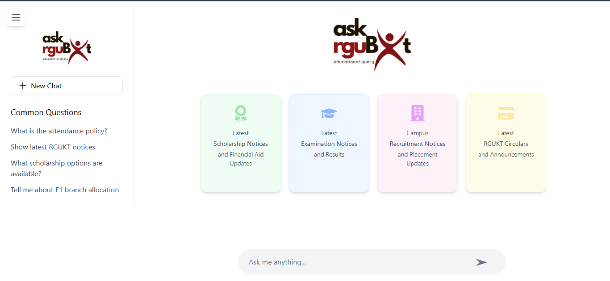
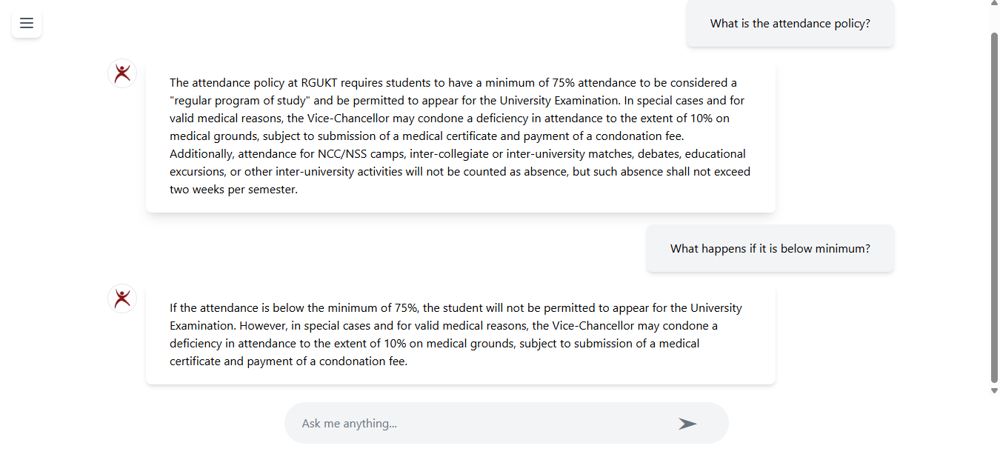
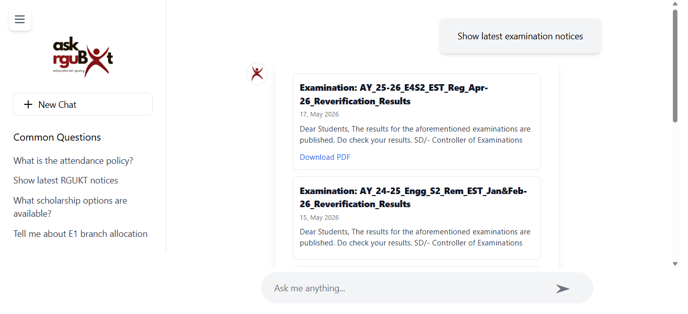
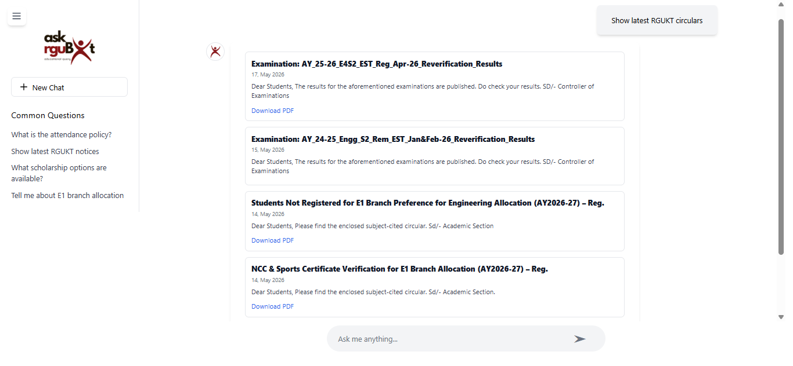

# AskAcademia 🎓

AskAcademia is an AI-powered academic assistant built for RGUKT students using LangChain, FastAPI, React, ChromaDB, and Groq LLMs.

It combines Retrieval-Augmented Generation (RAG), live notice scraping, and multi-tool AI agents to help students access academic regulations, department syllabus information, and the latest RGUKT notices through a conversational interface.

## ✨ Features

* 🤖 Multi-tool AI Agent using LangChain
* 📚 Department-wise RAG system
* 🧠 Conversational memory support
* 🔍 Semantic search using ChromaDB
* 📄 Source citations with page references
* 🌐 Live RGUKT notice scraping
* 📰 Structured notice cards with PDF download links
* ⚡ FastAPI backend with async APIs
* 🎨 Modern React + Tailwind frontend
* 🔗 Tool routing using Groq LLMs

## 🏗️ System Architecture

```
User
  ↓
React Frontend
  ↓
FastAPI Backend
  ↓
LangChain Agent
   ↙               ↘
RAG Tool       Notice Tool
   ↓               ↓
ChromaDB      RGUKT Notice Scraper
```

## 🛠️ Tech Stack

### Frontend
* React 
* Vite 
* Tailwind CSS 

### Backend
* FastAPI 
* LangChain 
* Groq API 
* ChromaDB 
* HuggingFace Embeddings 

### AI / RAG
* Llama 3 (Groq) 
* all-MiniLM-L6-v2 embeddings 
* Chroma Vector Database 

### Web Scraping
* BeautifulSoup 
* Requests 

## 📂 Project Structure

```
AskAcademia/
│
├── app/
│   ├── agent/
│   ├── tools/
│   ├── utils/
│   ├── rgukt_datasets/
│   └── app.py
│
├── frontend/
│
├── requirements.txt
├── README.md
└── start_server.py
```

## 🚀 Setup Instructions

### 1. Clone Repository

```bash
git clone https://github.com/ShailiBoddula/AskAcademia.git
cd AskAcademia
```

### 2. Backend Setup

Create virtual environment:

```bash
python -m venv venv
```

Activate virtual environment:
**Windows**

```bash
venv\Scripts\activate
```

**Linux / Mac**

```bash
source venv/bin/activate
```

Install dependencies:

```bash
pip install -r requirements.txt
```

Create `.env` file:

```bash
GROQ_API_KEY=your_groq_api_key
```

Run backend:

```bash
uvicorn app.app:app --reload
```

Backend runs at:

```bash
http://127.0.0.1:8000
```

### 3. Frontend Setup

Go to frontend folder:

```bash
cd frontend
```

Install dependencies:

```bash
npm install
```

Run frontend:

```bash
npm run dev
```

Frontend runs at:

```bash
http://localhost:5173
```

## 🧠 Example Queries

* What is the attendance policy? 
* Show latest RGUKT notices 
* Explain thermodynamics syllabus for mechanical engineering 
* What happens if attendance is below minimum? 
* Show scholarship notices 

## 📌 Key Functionalities

### 🔹 RAG Search
Searches department-wise academic documents using semantic retrieval.

### 🔹 Conversational Memory
Maintains context across follow-up questions.

### 🔹 Notice Scraping
Fetches and structures latest RGUKT notices dynamically.

### 🔹 Structured Notice Rendering
Displays notices as UI cards with downloadable PDFs.

## 📸 Screenshots
 
## Home Interface



---

## Attendance Policy with Conversational Memory



---

## Latest Examination Notices



---

## Structured RGUKT Circulars with PDF Downloads



**Suggested screenshots:**
- Attendance policy response 
- Notice cards UI 
- PDF download button 
- Memory follow-up query 
- Source citation rendering 

## 🔮 Future Improvements

* User authentication 
* Deployment on Vercel + Render 
* Voice input support 
* Multi-language support 
* Student personalization 
* Feedback analytics dashboard 

## 👩‍💻 Author

**Shaili Boddula**

Built as an AI-powered academic assistant project focused on improving student access to university information through conversational AI and RAG systems.

---

⭐ If you found this project useful, consider giving the repository a star!
